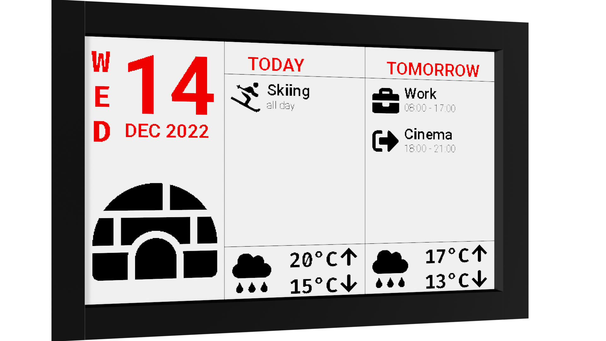

  <h1 href="https://github.com/joshmue/dayplanner">
    
  </h1>
  <h3 align="center">Dayplanner</h3>
  

    View your upcoming appointments on an ePaper display!
  

## About The Project

"Dayplanner" is a small collection of python scripts that render

* the current date
* events from any downloadable ICS calendar (e. g. Google Calendar)
* the general weather forecast for your exact location

on a bitmap which may be displayed on an ePaper display.

I let my display refresh every night, so events are updated daily.

See the `config-example.yaml` file on how to configure it.

Possible ICS sources:
* your existing Google Calendar
* local garbage collection organisations publishing garbage collection schedules
* Doodle ICS

### Built With

* Python libraries: Pillow, ics, icalendar, recurring-ical-events, requests, pyyaml
* Icons: FontAwesome etc.
* Weather data: OpenWeather
* Hardware (and software examples): [Waveshare](https://www.waveshare.com/) 7.5inch e-Paper V1, Raspberry Pi
